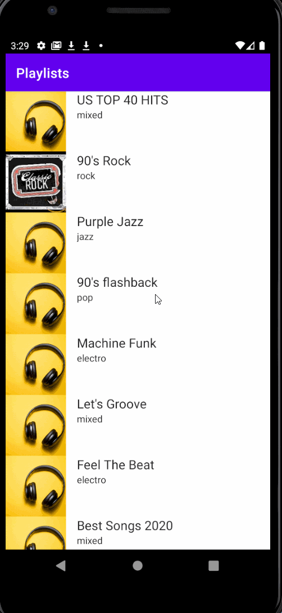

# Groovy

**Groovy** is an android app built using test-driven development and MVVM architecture. The app allows users to explore mock playlists differentiated by genre.

## User Stories

The following **required** functionality is completed:

* [x] Kotlin
* [x] Coroutines
* [x] Live Data
* [x] TDD - Espresso, JUnit
* [x] Retrofit
* [x] Hilt
* [x] Jetpack Navigation
* [x] MVVM

## Video Walkthrough

Here's a walkthrough of implemented user stories:

GIF created with [LiceCap](http://www.cockos.com/licecap/).

